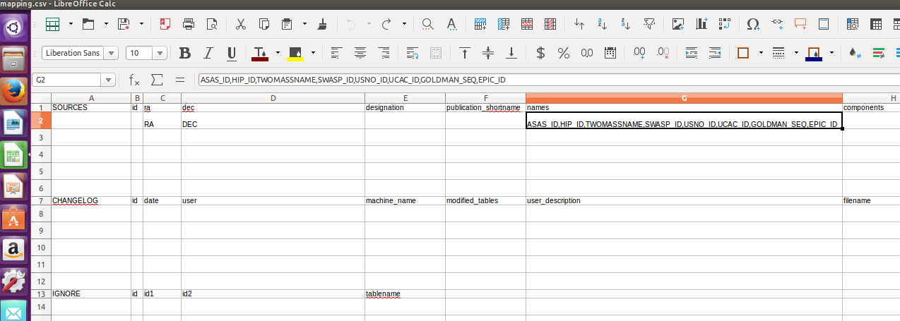

Columbia University Cool Stars Database
=======================================
This is the quickstart documentation for Columbia University Astronomy Lab's star cluster databases.

The databases can be accessed using the `online api <http://limelightpmdb.com/Astronomy.html>`_ and are also distributed as self contained, compressed folders.

Structure of the zip folder is as follows::

  <ClusterName>/
  ├── tabledata/
  │   ├── tablename1.sql
  │   ├── tablename2.sql
  .   . ... 
  │   └── tablenameX.sql
  ├── <ClusterName>schema.sql
  ├── <ClusterName>.db
  ├── mapping.csv
  └── databasetools.py

- tabledata folder contains the data to be input into each table of the database.
- <databasename>schema.sql contains the sql code for creating database schema and can be used with the contents of the tabledata folder to instantiate the star cluster database.
- <databasenane>.db is a stand alone binary file which can be used by astrodbkit as well as high level sql tools.
- mapping.csv contains the mapping of fits file into the database schema. More info can be found in the next pages.
- databasetools.py is a python script which provides functions that can be used to edit the database such as automatically importing a .fits file into the database. 

  
Supports
--------
- python3
- sqllite3

Dependencies
------------
- astrodbkit
- astropy

  
  
Installation and Setup
----------------------
Install dependencies using:

.. code-block:: bash

  $ pip install astrodbkit
  $ pip install astropy
  
Next, download and unzip the folder for the database you wish to use.

In order to access and use spectra you need to create the environment variable: $CUAL and point it to your local spectra folder.
To temporarily set this variable in linux you would type the following to the terminal:

.. code-block:: bash

   $ export CUAL = /path/to/spectra
   
You can make the variable persistent by adding this line to your .bash_profile.

You can also specify the path when instantiating dbtools class from databasetools.py:

.. code-block:: python

  >>> db = dbtools( pathtospectra = "/path/to/spectra" )

Using the database
==================
The .db binary file can be imported using any sqllite3 tool available. The recomended method for ease of use and functionality is the astrodbkit package.

If you are unfamiliar with astrodbkit, check the official documentation at `this link <http://astrodbkit.readthedocs.io/en/latest/index.html>`_ Below are some simple commands to get you started.

To start using the database, launch Python, import the module, then initialize the database with the 

.. code-block:: python

    from astrodbkit import astrodb
    db = astrodb.Database(path/to/dbfile)
    
or

.. code-block:: python

    from astrodbkit import astrodb
    db = astrodb.Database('schema.sql', directory='tabledata')

You can use:

.. code-block:: python

    db.info()
    
to explore the database and:

.. code-block:: python

    db.help()
    
for a brief overview of the astrodb.Database class.

You can get more information on the schema of any table using:

.. code-block:: python

    db.schema('tablename')
    
Search any table using:

.. code-block:: python

    db.search('keyword','tablename')
    
Query the database using:

.. code-block:: python

    data = db.query("SQL query as a string")
   

Editing the database
====================
Adding data
-----------
astrodbkit offers two ways to add data to the database: by passing a properly formatted ascii file or by passing the data directly in a list of lists.

To add data from a file, you want to create a file with the following format::

   ra|dec|publication_id
   123|-34|5

Each entry should be its own row, with the first row denoting the columns to be populated.
Note that the column names in the ascii file need not be in the same order as the table.
Also, only the column names that match will be added and non-matching or missing column names will be ignored.
Assuming this file is called **data.txt** in the working directory, we can add this new data to the SOURCES table with

.. code-block:: python

   db.add_data('data.txt', 'sources', delim='|')

To add the same data without creating the file, you would do the following

.. code-block:: python

   data = [['ra', 'dec', 'publication_id'],[123, -34, 5]]
   db.add_data(data, 'sources')

Importing .fits files
---------------------

You can import data from a fits files using the databasetools.py file provided. This method can be used to create a new database from the fits file or modify an already existing one.

You must first import the dbtools class from the module and instantiate the dbtools class. To do that cd into the unzipped folder and start python. Then:

.. code-block:: python

   from databasetols import dbtools
   
   dbtool = dbtools()
   
Remember to provide path to the spectra files if you have not set environment variable CUAL:

.. code-block:: python

    dbtool = dbtools( pathtospectra = "/path/to/spectra" )

Next generate a clean mapping file using the:

.. code-block:: python

   dbtool.create_mapping(filename = 'mapping.csv')
   
This will generate an initial mapping file which has the column names for each table listed and 5 empty rows below each table. Open this file using an editor such as Excel and enter the fits header name that corresponds to a table's column into the cell under the column name for that table. If multiple fits headers reference one column name, just input all into the cell and separate them by a comma (',').

An example entry will look like this:

In the example above. fits file has two sections named 'RA' and 'DEc' which correspond to the ra and dec columns in SOURCES Table respectively. The fits file also has sections ASAS_ID, HIP_ID, TWOMASSNAME, SWASP_ID ,USNO_ID ,UCAC_ID ,GOLDMAN_SEQ ,EPIC_ID which are all names used for the stars and as such they are entered into the  cell below the 'name' column of SOURCES table as comma separated values

Once you have the mapping file filled, use:

.. code-block:: python

    dbtool.add_fits('/path/to/fitsfileName','mapping.csv')
    
In order to populate the database from the fits file.

Developer
---------
For a more in depth documentation of functions check to comments inside the databasetools.py file or go to: link.

....

